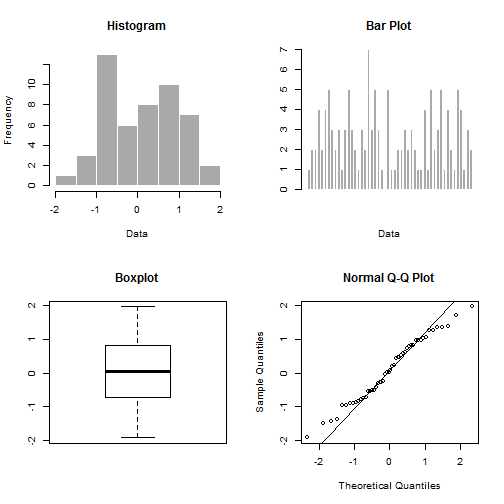
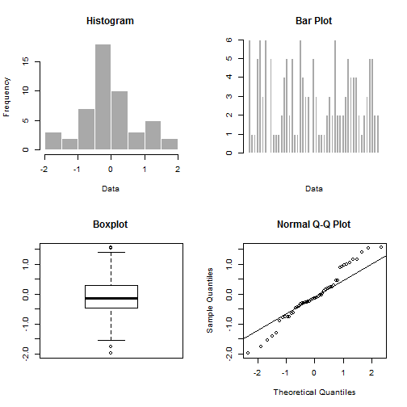

## Introduction


**Exploratoray Data Analysis (EDA)** is an approach to analyzing datasets to summarize their main characteristics, often with visual methods. We perform the following as part of EDA:

1. Summary Statistics

2. Data Visualization

  2.1 Stem and Leaf Plot
  2.2 Histogram/Bar Plot
  2.3 Box Plot

3. Tests for Normality (if Data Type is continuous)

  3.1 Q-Q Plot
  3.2 Shapiro-Wilk Test for Normality

The App is available online at <https://abhishekumrawal.shinyapps.io/ShinyAppforEDA>.

--- .class #id 


## App Input and App Execution

The App needs the following two inputs:

**Please enter name of the CSV data file without extension:**

The input here is the name of a CSV file which has the data.

**Please select the Data Type:**

1. **Continuous** 

2. **Discrete** 

The input here is to select one of the above two.

App is executed by clicking on **Perform EDA**.

--- .class #id 

## App Output

The App produces all the already discussed things in a nice and systematic manner.

Some Sample Plots produced by the App are as follows:

 

--- .class #id

## Conclusion

The App makes the Exploratory Data Analysis easier, as its just a click away. Moreover, visualization of data, outlier detection and normality testing are the common requirements of any further statistical modeling. Hence, before using any data for Modeling and Prediction, this App can be used as a Pre-Processing Tool for it.

Please try out the App online. Thanks for your time in going through the presentation. I hope you appreciate my efforts.

### Appendix

The R code which gets evaluated in order to get the plots on slide 4 is as follows. I had put echo = FALSE there to display only the plots. 

```r
x<-rnorm(50);y<-rpois(50,3)
par(mfrow=c(2,2))
hist(x, col = 'darkgray', border = 'white', main="Histogram", xlab= "Data")
barplot(y, col = 'darkgray', border = 'white', main="Bar Plot", xlab= "Data")
boxplot(x, main="Boxplot")
qqnorm(x);qqline(x)
```

 
